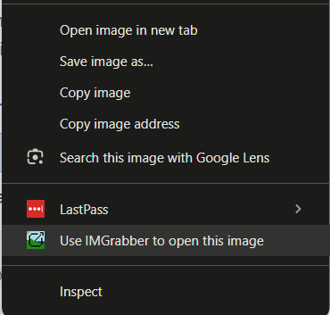
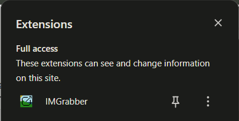

# IMGrabber

IMGrabber is a Chrome extension too view and download images on any website. Scan any webpage to grab all images in one place, or right-click an image and instantly open it in a new tab. Built with Chrome Manifest V3, clean popup UI, and a sleek context menu integration.

## Installation

1. Clone the repo
2. Unpackage the ZIP File
3. **Go to the Chrome Extensions page:** `chrome://extensions/`
4. Select Load Unpackaged file
5. Select IMGrabber
6. Refresh the page

Note: After you load the package into chrome, you no longer need to keep it on your computer

## Example

  
  
  

